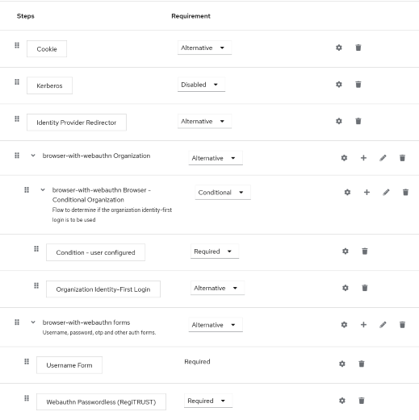

# Keycloak - Extension to enforce login with organization's authorized passkey

# About
This plugin is designed for Keycloak (version 26.0.0) to extend the functionality of the WebAuthnPasswordlessAuthenticator. RegiTRUST requires that users of its trust entry management system log in using the hardware passkey provided by the organization. By default, Keycloak allows users to register additional passkeys, enabling logins with different keys. This flexibility violates RegiTRUST's organizational policy, which mandates the use of the same passkey issued by the organization.

To enforce this policy, the plugin performs the following actions:
1. It stores the official passkey's Credential ID as a hidden attribute in the user's profile. This occurs automatically when the passkey is first used for login, with the assumption that organizational administrators will perform this task.
2. For subsequent logins, the plugin checks that the Credential ID of the passkey used for authentication matches the saved Credential ID in the user profile.

This ensures users can log in only with the passkey provided by the organization.

# Compilation

> mvn clean package

# Installation
Run following bash commands:

    cd <keycloak-install-directory>/providers 
    cp <keycloak-RegiTRUST-Authenticator-directory>/target/keycloak-webauthn-regitrust.jar .
    systemctl stop keycloak
    systemctl status keycloak
    cd /opt/keycloak/bin
    ./kc.sh build 
    ./kc.sh show-config 
    systemctl start keycloak 
    systemctl status keycloak 

# Configure the authentication flow for the Realm that should use this authenticator

* Login to keycloak with an account that has administrative permissions.
* Choose the REALM -> Authetication.
* Select the browser flow and duplcate it.
* Rename it as RegiTRUST-Browser Flow.
* Modify the flow to use the "Webauthn Passwordless (REgiTRUST)" as a step.
* Final flow may look like this:

  
* Create a user profile attribute in the Realm settings->User profile.  Name the attribute WebauthnCredentialID set permissions to allow Admin edit and view, and none for the User (do not allow user to edit or view). 

# Test
* Login as REALM Administrator 
* Create a new user
* Set required action for the user "Webauthn Register Passwordless"
* Logout as administrator
* Login as the new user
* Setup a Passkey for the new user.
* Logout
* Login as new user using the Passkey.
  > Navigate to https://\<keycloak-domain\>/realms/\<realm\>/account/ to login as that user.

  Once user is logged in the plugin will populate the WebauthnCredentialID profile attribute with Credential Id of the key used for authentication.
* Logout
* Login again as the user with the official key.  It should succeed.
* Navigate to account-security->Signing In.
* Setup another passkey in Passwordless - Passkey section.
* Logout.
* Try loging with the same user using the second passkey that was configured (not the key that was used for the first time)
* Login should fail with an error message.

# About author
The plugin was created by [Axyom.co](https://www.axyom.co) a division of [SymSoft Solutions](https://www.symsoftsolutions.com).  Please reach out to abdul at symsoftsolutions.com for any questions or clarifications.
 

