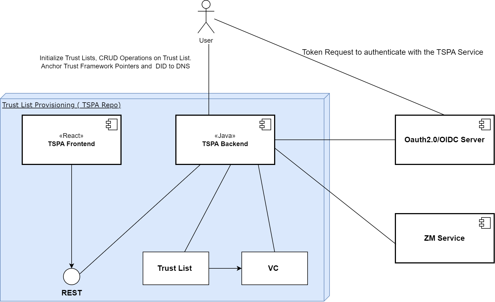
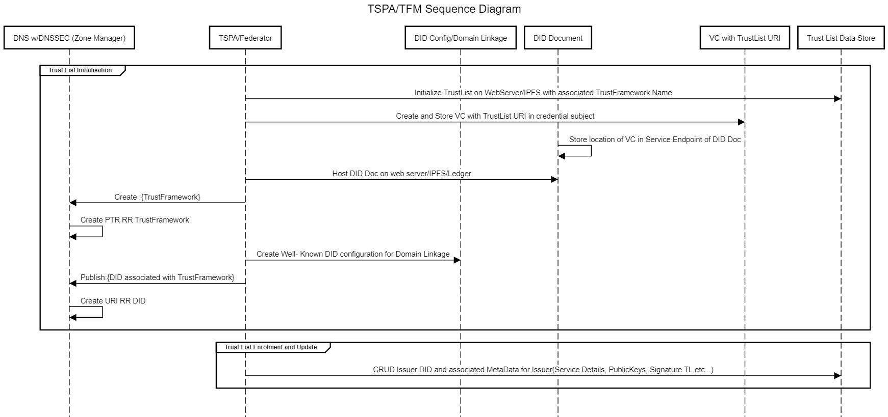

# The overarching TRAIN Architecture
The overarching TRAIN architecture documentation is located in the [Train Architecture Documentation](https://gitlab.eclipse.org/eclipse/xfsc/train/TRAIN-Documentation) repository.

# TSPA Component Diagram:
TSPA High level component diagram can be found below:

# Data Flow Diagram:

Trust Framework/ Trust List Initialization with DID anchoring and CRUD operations on trust list is explained on the following data flow diagram:

# Note:

- DID Document Hosting is not part of this TSPA Process and it has be done manually.
- Similarly Hosting well-known did-config also has to be done manually. But TSPA helps with it's API endpoints to create well-known DID Config VCs.

