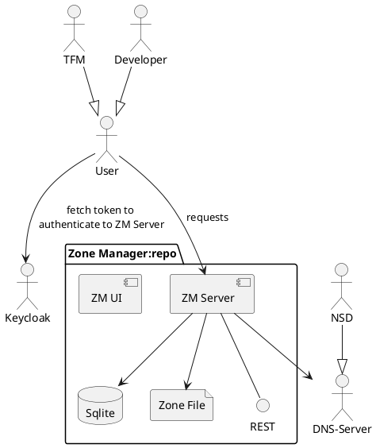

# DNS ZoneManager for Regi-TRUST phase 2.

Based on the implementation done for the GXFS (XFSC) project in 2023-2024.
Documentation is still being simplified to match the needs of Phase 2...

- [Description](#description)
- [Architecture](#architecture)
- [Build guide](#build-guide)
- [REST API](./docs/ZM_openapi.yaml)
- [Postman collection](./docs/ZM_RegiTRUST_phase_2_postman_collection.json)
- [Licence](./LICENSE)
- [Acknowledgement](#authors-and-acknowledgment)

## Description

The DNS Zone Management is the component responsible for managing the DNS zone file and used for
anchoring the trust framework DID information into the zone file. It is also responsible for resigning
the zone file based on DNSSEC for every new update in the zone file.
The zone manager service was designed to serve the [Trust Framework Manager](../tfm/) only.
It manages a zone file by:

- Creating an intermediate database for NS, A, PTR and URI records
- Providing auth mechanism to protect endpoints
- Exposing secure endpoints for managing PTR records (associated with trust frameworks) and URI records (associated with trust lists)
- Updating records and resigning zone file
- Using DNSSEC to provide and additional security layer to the DNS service

The implementation was done based on [LIGHTest zone manager](https://github.com/H2020LIGHTest/ZoneManager).

## Architecture

### System overview



The zone manager is meant to have the TSPA as its only client. The TSPA can perform CRUD operations
in relation to Trust Frameworks and Trust Lists. The Zone Manager takes every operation request and
updates the zone file accordingly. It takes care of adding and deleting records to the zone file and
its required signing.

A simple description of the flow:
At startup, the Zone Manager sets up the DNS server (NSD or KNOT) and creates a database with the base
SOA, NS and A type resource records which are then formatted, signed and used to create a zone file.
A Trust Framework creation request can then be initialized by the TSPA. When this happens, the Zone
Manager converts the Trust Framework's URL into a PTR record, stores in the database and anchors it
in the DNS system by updating the zone file accordingly.
In the case of creation of Trust List DID, the process is similar with only difference being that the
DID are stored as URI type records in the database as well as in the zone file.

This is repeated every time a CRUD operation in relation to Trust Framework URLs and Trust List DIDs.

The current Zone Manager implementation includes a simple UI that allows the administrator to visualize
the zone data. See the [user interface folder](ui)

## Build guide

### Requirements

Although we provide a docker file for containerized deployment, we recommend allocating a single separate ubuntu instance for the ZM and build it and run it locally.

- OS: Unix based
- Python 3.11 or higher
- Project dependencies (see [requirements.txt](./requirements.txt))
- Additional dependencies (see below)

The ZM uses LDNS python bindings which unfortunately are not available via pypi.org, so we need to install them manually.

```bash
sudo apt install nsd python3-ldns cron systemd -y
#optional dev dependencies
sudo apt-get install dnsutils -y
sudo apt-get install dnsmasq -y
sudo apt install nano  && apt install iputils-ping -y
```

### Building Zone Manager

1. Define the environment setup.

   Define the primary and secondary servers including DNS names and IP addresses. The primary server will host and run the zone manager service as well as the zone file. See [properties definitions](./docs/ConfigProperties.md) for details.
   You can do this by copying and editing
   the configuration file:

   ```bash
   cp config.sample.conf config.conf
   vim config.conf # add your configuration
   ```

   Define the OpenID identity provider settings for the Oauth authentication of endpoints. For this, two variables must be defined in a file called auth.conf: `ISSUER_URL` and `CLIENT_ID`. You can do this by:

   ```bash
   cp auth.sample.conf auth.conf
   vim auth.conf # add your configuration
   ```

   Also, refer to [properties definitions](./docs/ConfigProperties.md) for details.

   As an additional reference, you can find a sample Keycloak realm configuration file in the [docs](./docs) folder.

2. Build and run the Zone Manager.

   The [script.sh](./script.sh) file automated the NSD and server setup. You need to pass the port number as an argument to the script (don't forget to be consistent when setting up the TFM at a later stage). Simply run it from the root folder:

   ```bash
   ./script.sh 16001
   ```

   The NSD server listens for nsd resolutions queries by default on 53 and 53/udp.

## Authors and acknowledgment

Current project implementation by Fraunhofer IAO:

- Juan Vargas [Gitlab](https://gitlab.eclipse.org/juanvargas)/[Github](https://github.com/jcamilov)
- Isaac Henderson [Gitlab](https://gitlab.eclipse.org/isaachenderson)/[Github](https://github.com/hendersonweb)

Project based on [LIGHTest zone manager](https://github.com/H2020LIGHTest/ZoneManager).
