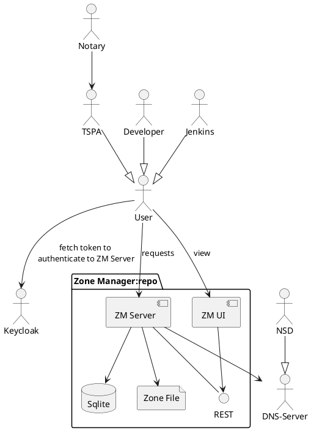

# DNS ZoneManager for Regi-TRUST phase 2.

Based on the implementation done for the GXFS (XFSC) project in 2023-2024.
Documentation is still being simplified to match the needs of Phase 2...

- [Description](#description)
- [Architecture](#architecture)
- [Build guide](#build-guide)
- [Installation guide](./docs/install/)
- [Operation](./docs/operations/)
- [GDPR design decisions](#gdpr-design-decisions)
- [Security concept](#security-concept)
- [FAQ](https://gitlab.eclipse.org/eclipse/xfsc/train/TRAIN-Documentation#frequently-asked-questions)
- [Keyword Directory](https://gitlab.eclipse.org/eclipse/xfsc/xfsc-spec-2/-/blob/main/docs/train/train.md?ref_type=heads#definitions-acronyms-and-abbreviations)
- [Licence](./LICENSE)
- [Acknowledgement](#authors-and-acknowledgment)

## Description

The DNS Zone Management is the component responsible for managing the DNS zone file and used for
anchoring the trust framework DID information into the zone file. It is also responsible for resigning
the zone file based on DNSSEC for every new update in the zone file.
The zone manager service was designed to serve the [Train Trust Framework Manager](https://gitlab.eclipse.org/eclipse/xfsc/train/tspa) only.
It manages a zone file by:

- Creating an intermediate database for NS, A, PTR and URI records
- Providing auth mechanism to protect endpoints
- Exposing secure endpoints for managing PTR records (associated with trust frameworks) and URI records (associated with trust lists)
- Updating records and resigning zone file
- Using DNSSEC to provide and additional security layer to the DNS service

The implementation was done based on [LIGHTest zone manager](https://github.com/H2020LIGHTest/ZoneManager).

## Architecture

### System overview



The zone manager is meant to have the TSPA as its only client. The TSPA can perform CRUD operations
in relation to Trust Frameworks and Trust Lists. The Zone Manager takes every operation request and
updates the zone file accordingly. It takes care of adding and deleting records to the zone file and
its required signing.

A simple description of the flow:
At startup, the Zone Manager sets up the DNS server (NSD or KNOT) and creates a database with the base
SOA, NS and A type resource records which are then formatted, signed and used to create a zone file.
A Trust Framework creation request can then be initialized by the TSPA. When this happens, the Zone
Manager converts the Trust Framework's URL into a PTR record, stores in the database and anchors it
in the DNS system by updating the zone file accordingly.
In the case of creation of Trust List DID, the process is similar with only difference being that the
DID are stored as URI type records in the database as well as in the zone file.

This is repeated every time a CRUD operation in relation to Trust Framework URLs and Trust List DIDs.

The current Zone Manager implementation includes a simple UI that allows the administrator to visualize
the zone data. See the [user interface folder](ui)

## Getting Started

To get started with the TRAIN framework as a whole on your local machine and make requests against the TRAIN components refer to our [Local Setup Guide](https://gitlab.eclipse.org/eclipse/xfsc/train/TRAIN-Documentation/-/tree/main/demonstration/local?ref_type=heads)

The guide will show you how to run all required components in a local docker network configuration (excluding UIs) as well as have Postman collections you can use to make use of your local TRAIN instance.

**Note: Running the TDZM UI locally in docker requires a non-local OIDC Server instance due to the browser being outside the docker network.**

## Build guide

### Requirements

- OS: Unix based
- Docker v24.0.7
- Dependencies (see [requirements.txt](./requirements.txt))

### Building Zone Manager (excl. UI) locally for development purposes

1. Define the environment setup.

   Define the primary and secondary servers including DNS names and IP addresses. The primary server will
   host and run the zone manager service as well as the zone file. You can do this by copying and editing
   the configuration file:

   ```bash
   cp config.sample.conf config.conf
   vim config.conf # add your configuration
   ```

   Define the OpenID identity provider settings for the Oauth authentication of endpoints. For this, two variables
   must be defined in a file called auth.conf: `ISSUER_URL` and `CLIENT_ID`. You can do this by:

   ```bash
   cp auth.sample.conf auth.conf
   vim auth.conf # add your configuration
   ```

   As a reference, you can find a sample Keycloak realm configuration file in the [docs](./docs) folder.

   For information on what the individual Configuration settings mean check [here](https://gitlab.eclipse.org/eclipse/xfsc/train/dns-zone-manager/-/tree/master/docs/install?ref_type=heads#charts-for-tdzm-backend--dns-server)

2. Build and run Docker container
   Build the Docker image

   ```bash
   $ docker build -t localhost/zone-manager .
   [+] Building 19.9s (13/13) FINISHED ...
   ...
   => => naming to localhost/zone-manager
   ```

3. Run the container

   Before running the container, please make sure that you configure your host dns resolver
   and proxy so requests are properly forwarded to the container.
   The NSD server in the zone manager container listens by default on port 53 and 53/udp.

   The Zone Manager container must be run including the mapping of two ports:

   - ZM Server port: listens for API REST calls, by default on 16001
   - NSD server port: listens for nsd resolutions queries by default on 53 and 53/udp

   This is covered by running:

   ```bash
   $ docker run -p 16001:16001 -p 53:53 -p 53:53/udp localhost/zone-manager
   ...
   [2024-01-17 10:51:21 +0000] [79] [INFO] Starting gunicorn 19.9.0
   [2024-01-17 10:51:21 +0000] [79] [INFO] Listening at: http://0.0.0.0:16001 (79)
   [2024-01-17 10:51:21 +0000] [79] [INFO] Using worker: sync
   [2024-01-17 10:51:21 +0000] [80] [INFO] Booting worker with pid: 80

   ```

4. Optionally, run tests once the zone manager server is up

   See the [tests](/tests) for details. The tests include getting a valid token from the configured identity provider.
   If you have not set your IdP, please do so now (see step 1). To run the tests:

   From the root folder run:

   ```bash
   pytest
   ```

## GDPR design decisions

The Zone Manager design is covered by the rules specified in the [GDPR compliance document](https://gitlab.eclipse.org/eclipse/xfsc/train/TRAIN-Documentation/-/blob/main/concepts/gdpr/Readme.md).

## Security concept

Please refer to the TRAIN Architecture documentation - [security concept](https://gitlab.eclipse.org/eclipse/xfsc/train/TRAIN-Documentation/-/tree/main/concepts/security).

## FAQ

Please refer to our global FAQ Page here: https://gitlab.eclipse.org/eclipse/xfsc/train/TRAIN-Documentation#frequently-asked-questions

## Authors and acknowledgment

The Zone Manager project was implemented with help of:

- [Andrei Danciuc](https://gitlab.eclipse.org/andreidanciuc)
- [Isaac Henderson Johnson Jeyakumar](https://gitlab.eclipse.org/isaachenderson)
- [Michael Kubach](https://gitlab.eclipse.org/mkubach)
- [Michael Zigldrum](https://gitlab.eclipse.org/mzigldrum)
- [Juan Vargas](https://gitlab.eclipse.org/juanvargas)

Project based on [LIGHTest zone manager](https://github.com/H2020LIGHTest/ZoneManager).
