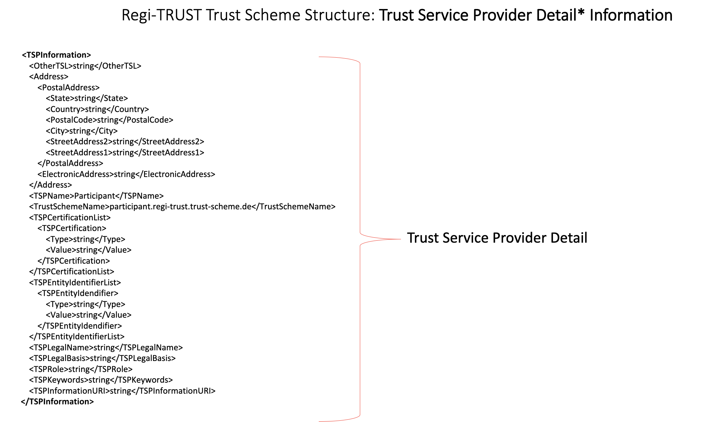

## Regi-TRUST

### Trust Scheme Example 

 

### Project Background

 

### Intended Outcomes
Offer a decentralized, inclusive, and flexible digital trust infrastructure and a suite of supporting tools as a Digital Public Good (DPG) 
Provide comprehensive policy and governance guidelines to support operationalization of networks or ecosystems built on the infrastructure 
Develop practical use cases for the infrastructure and support their global implementations 

### Project Status – Phase 1  
Period: July 2022 to March 2023 
The project is in the middle of its first phase, with three areas of focus:  
1. Development of v1.0 technical specification and core
Technical Specification: [Public Review Draft] (https://docs.google.com/document/d/1MOmhbPsVhGEULUeBhUdieYzpi6VzdPZedCAHb5aHEE0/edit?usp=sharing)
Open Source Reference Implementation

2. GCCN Pilot - contained pilot(s) for the COVID-19 certificate use case
The Global COVID-19 Certificate Network (GCCN) provides a global infrastructure that allows individuals to share key health data in a trusted manner both inside and outside of their countries, starting with their COVID-19 certificates. It provides an important platform for global reopening, but also a futureproofed digital infrastructure for future pandemics, health crises, or other priorities requiring verification. There is no such solution today that addresses equitable and inclusive systems of care for cross-border scenarios in a way that enables countries or jurisdictions at various levels of economic development to participate equally.
More information about the [pilot projects] (https://drive.google.com/file/d/1tOQzh55l5b0nhtNc57gmzftPCXk7qjLu/view?usp=sharing).  
 
3. Development of v1.0 policy and governance guidelines
UNDP launched a four-week open consultation to identify the key governance attributes, drivers, and considerations – from the scope of governance, governance structures and related considerations, to the role of governance in scaling the network. We aim to develop policy and governance guidelines for COVID-19 certificate/public health emergency that could be extended to other uses of Regi-TRUST.
More information about the [governance consultation] (https://www.sparkblue.org/Regi-TRUST)

